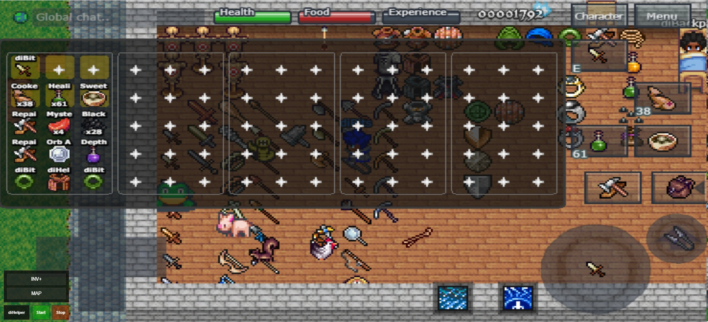
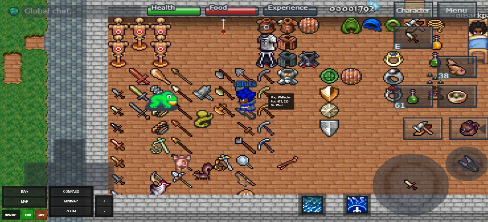
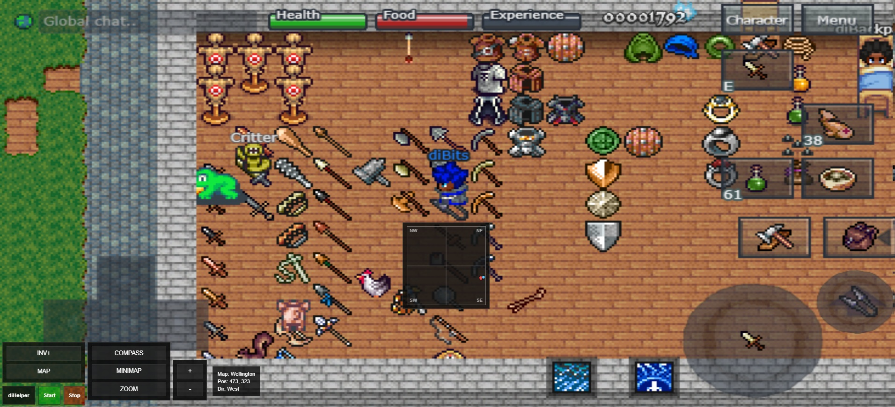
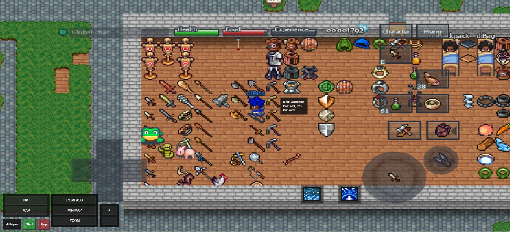

# diHelper

Extensão para Chrome/Chromium (Manifest V3) voltada para **Qualidade de Vida (QoS)** no client web do **Mystera Legacy**.

O foco do projeto é adicionar recursos visuais e utilitários que melhorem a experiência do jogador sem alterar a lógica principal do jogo.

Sec 21, né, Brothers? Peça a uma I.A. para verificar a possibilidade de vírus ou algum logger que roube senhas.

Como baixar e instalar

#1. Baixar o projeto do GitHub

Você pode baixar o projeto de duas formas.

#Baixar ZIP
1. Acesse o repositório no GitHub
2. Clique em **Code**
3. Clique em **Download ZIP**
4. Extraia o arquivo em uma pasta no seu computador (Use winzip ou winrar o que estiver no seu pc)
5. Instalar Chrome / Brave
   1. Abra navegador
   2. Acesse chrome://extensions (o brave e uma copia do chorme sem popup)
   3. Ative modo de desenvolvedor
   4. Clique em Carregar sem compactação (tem que usar o winzip ou winrar zezão)
   5. Selecione a pasta do projeto diHelper
6. A extensão foi projetada para funcionar em: https://www.mysteralegacy.com/play/full.php

---

## Objetivo

O **diHelper** foi criado para entregar melhorias visuais e funcionais de forma modular, compacta e organizada, mantendo respeito pela experiência original do client web.

A proposta do projeto é:

- melhorar leitura visual
- facilitar organização
- adicionar utilidades de interface
- manter arquitetura modular e expansível
- evoluir por features sem bagunçar a base do código


A ideia não é “transformar o jogo em outra coisa”, mas sim construir uma camada auxiliar mais confortável, mais legível e mais organizada.

---

## Funcionalidades Atuais

### Inventário Plus (INV+)

O módulo de inventário expandido fornece uma visualização auxiliar do inventário com foco em legibilidade e praticidade.

Atualmente inclui:

- grade expandida
- renderização de itens
- nome dos itens
- quantidade
- drag and drop funcional entre slots

O objetivo do **INV+** é facilitar leitura, organização e manipulação visual dos slots de forma mais prática que a interface original.

<p align="center">
  
</p>

---

### Compass

O módulo de bússola mostra informações contextuais úteis do mapa atual.

Atualmente inclui:

- mapa atual
- posição do player
- direção
- overlay arrastável
- persistência de posição

O compass foi pensado como um recurso leve e direto, voltado para leitura rápida durante a jogabilidade.

<p align="center">
  
</p>

---

### Minimap

O minimapa atual já está funcional como um **localizador proporcional baseado na viewpoint disponível do mapa**.

Atualmente ele utiliza:

- dimensões conhecidas do mapa atual
- posição do player
- posição de entidades carregadas
- representação por quadrantes
- Futuramente, mapear objetos visíveis e montar um mapa completo atualizável.
  
Importante:

> O minimapa atual trabalha sobre a **viewpoint carregada/disponível**, sem interferir na jogabilidade e sem alterar a lógica do servidor.

Ou seja:

- não expande artificialmente o mapa do jogo
- não altera range do servidor
- não força carregamento além do disponível
- não modifica a mecânica do mundo
- apenas representa visualmente a informação disponível no client

<p align="center">
  
</p>

---

### Zoom

O projeto já possui uma implementação funcional de zoom visual integrada ao submenu de mapa.

Atualmente inclui:

- `ZOOM +`
- `ZOOM -`

O zoom funciona como recurso visual auxiliar, ajudando na leitura do cenário dentro do limite seguro definido no projeto.
o zoom não altera a posição ui original do sistema.

<p align="center">
  
</p>

---

## Menu Modular

O menu do diHelper está organizado de forma compacta para facilitar expansão futura sem poluir a interface.

Estrutura atual:

- `INV+`
- `MAP`
  - `COMPASS`
  - `MINIMAP`
  - `ZOOM`
    - `+`
    - `-`

Essa estrutura permite crescimento contínuo sem desmontar a base do projeto.

---

## Estrutura do Projeto

A base do projeto está organizada de forma modular, separando responsabilidades por camada.

```text
src/
├── core/
├── game/
├── modules/
│   ├── compass/
│   ├── inventory/
│   ├── minimap/
│   └── zoom/
└── ui/